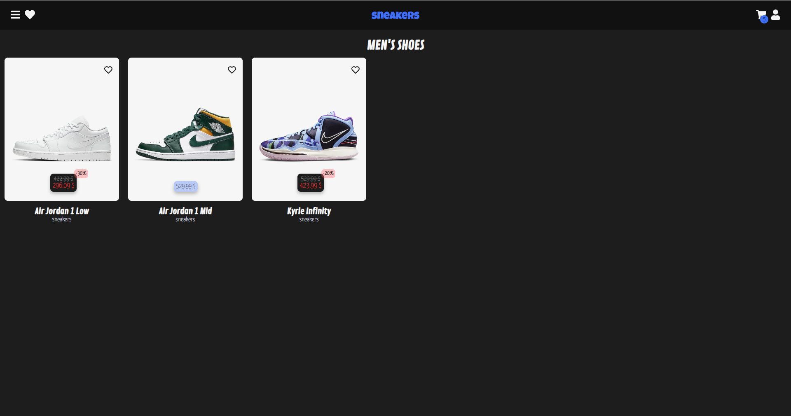
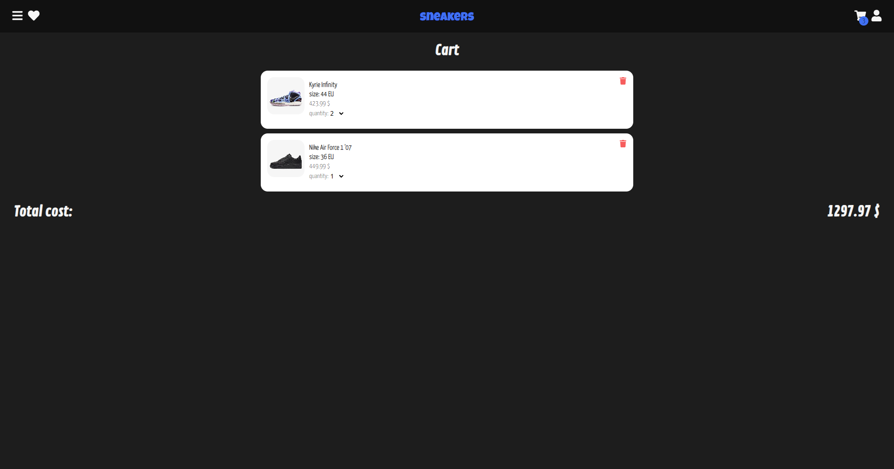
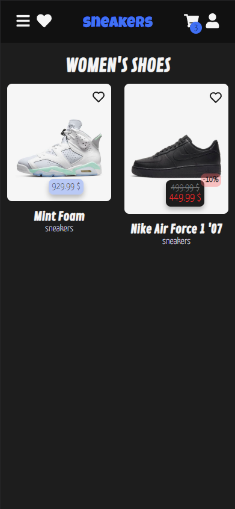
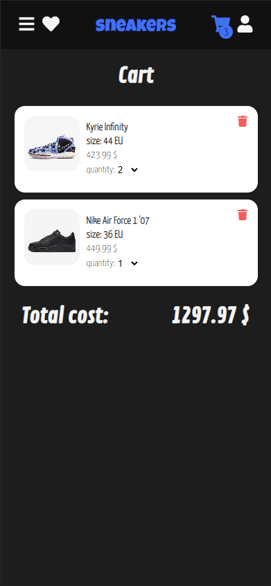

# SNEAKERS

## :scroll:DESCRIPTION

I used NextJS to create Sneakers. In this project, I extended my knowledge of database connection. Specifically with MongoDB. The site is divided into women's and men's segments. Specific shoes can be added to favorites or to cart. There are a lot of flavors on the site so feel free!

## :link:DEMO

 Feel free to check ! :D
-> https://sneakers-next.netlify.app<-

## :camera:SCREENSHOTS

### Desktop

  

### Mobile

  

## :checkered_flag:GETTING STARTED

Run the following commands in order to have the code up and running on your machine:

``` bash
# installs dependencies
$ npm install
# run app
$ npm start
```

### Compiles and minifies for production

```
npm run build
```

### Lints and fixes files

```
npm run lint
```

### Customize configuration

See [Configuration Reference](https://cli.vuejs.org/config/)
